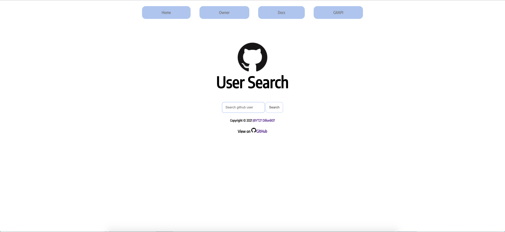
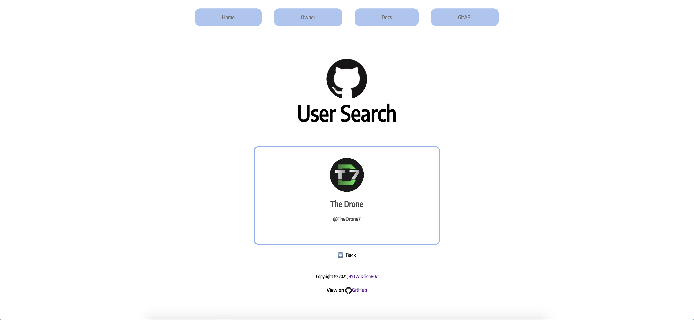
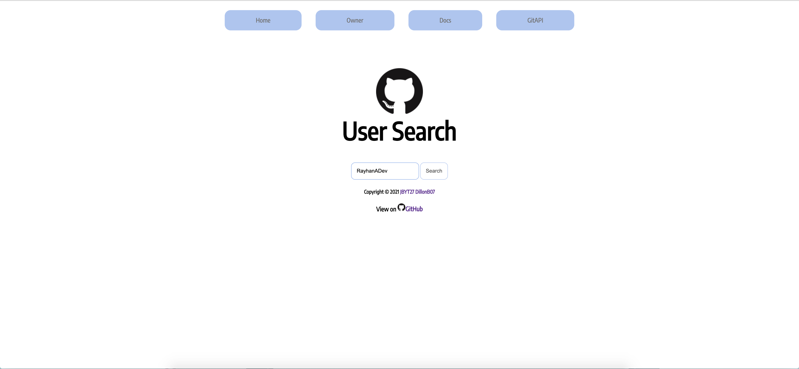
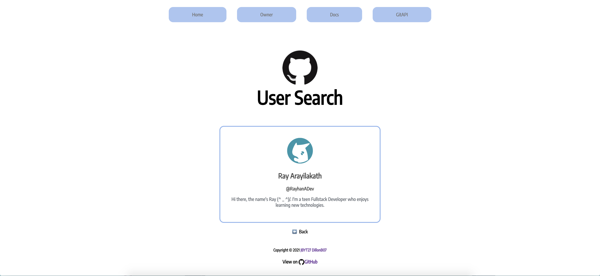

# GitHub User Search - Search all the GitHub users!

> Created using [Python3](https://python.org) and [git_api](https://pypi.org/project/git-api/), coded by [JBYT27](https://github.com/JBYT27).

## About
This project was first an idea for KaJam, however, I got stumped on a problem, so I couldn't submit it in time. So I decided to continue coding it *out* of the jam! Basically, this is just a clone of @RayhanADev's [Replit User Search](https://replit-user-search-v3.rayhanadev.repl.co/). The difference is, this retrieves GitHub user data instead :D

> _**Please note that it takes a few times to reload for the correct information to come up. We will try to solve that problem as soon as we can. Thank you!**_

## Using it
All you need to do is enter a GitHub username in the textbox, press the search button, and the data will come up. Feel free to leave suggestions! Thanks!

> Open it in a [**new tab**](https://github-user-search.jbloves27.repl.co/) to access it!

#### Example searches:

## How it works
To view how it works, go [here](https://github.com/JBYT27/GitHub-User-Search/blob/main/howitworks.md) to read it.

## Conclusion
I hope you enjoy using this! To contribute, you can either leave a comment on the [Replit Spotlight](https://replit.com/@JBloves27/GitHub-User-Search?v=1) post, the Replit [post](http://replit.com/talk/share/sparkles-GitHub-User-Search-Search-all-GitHub-Users-sparkles/147895), or leave a PR on the [GitHub](https://github.com/JBYT27/GitHub-User-Search) page. Stay well!

## Important Links
### License
This project is under the [MIT License](https://github.com/JBYT27/GitHub-User-Search/blob/main/.github/LICENSE).

### Code of Conduct
The Code of Conduct is located [here](https://github.com/JBYT27/GitHub-User-Search/blob/main/.github/CODE_OF_CONDUCT.md).

### Project link
The project link is [here](https://GitHub-User-Search.jbloves27.repl.co). 

### Features
- [ ] Dark mode/light mode - `[Status: PENDING]`
- [x] GitHub user information - `[Status: COMPLETE]`
- [x] CSS Animation - `[Status: IN PROGRESS]`
  - [x] Professional CSS - `[Status: INCOMPLETE]`
- [x] Additional features - `[Status: IN PROGRESS]`
- [x] Errors and error redirects - `[Status: IN PROGRESS]`
- [ ] Add docs - `[Status: IN PROGRESS]`
- [ ] Add contributers route (maybe) - `[Status: PENDING]`
